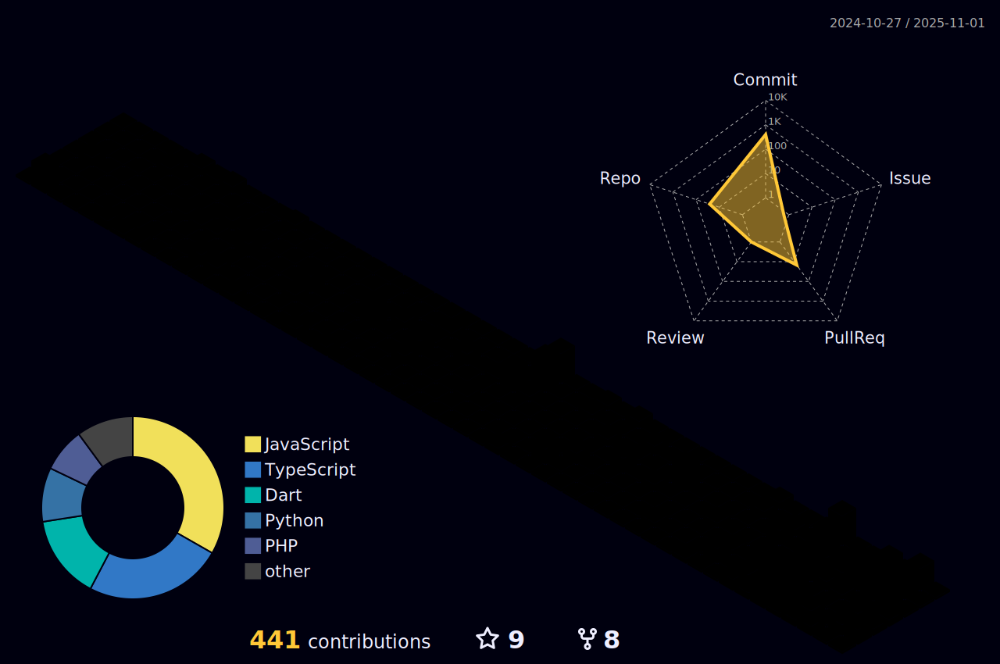

<h1 align="center">Hi 👋, I'm Muhammad Saad Siddique</h1>
<h3 align="center">I'm Software Developer with 5 years of experience providing high-impact web and mobile solutions for diverse industries and organizations. With a focus on Android and mobile development, I have a diverse skill set that includes SQL, MySQL, Python, Java, C++, C#, Kotlin, and Firebase. I specializes in designing, developing, and testing mobile and web-based applications and incorporating various technologies to optimize products. I can also write scripts to extract data, implement MVVM architecture, and shape features individually.</h3>

## WHO am I

- 🔭 I’m currently working on [Pakrism Android App](https://play.google.com/store/apps/details?id=com.pakrism)

- 🌱 I’m currently learning **DevOps, Kotlin, Machine Learning, Data Sciences etc**

- 🤝 I’m looking for help with [Microfinance Bank in Salesforce](https://github.com/MuhammadSaadSiddique/SaleforceBank)

- 💬 Ask me about **Coding Problems, Ideation, Android**

- 📫 How to reach me **8msaad@gmail.com**

- ⚡ Fun fact **Friends call me Alien**

## 💻 Languages and Tools

                                  

##  Connect with me

	<a href="https://www.datacamp.com/profile/muhammadsaad2387" target="blank">Datacamp</a>	

	
<a href="https://opensea.io/SaadSiddique" target="blank">My NFTs</a>
<a href="https://www.fiverr.com/seo_creators" target="blank">Buy my services at Fiverr</a>

  

# Contribution Graph

# Github Contributions
<h4 align="center">Isometric view of contributions in the last year</h4>

	

## 🔥 Streak Stats
	

 
	
## 💻 GitHub Profile Stats

	

